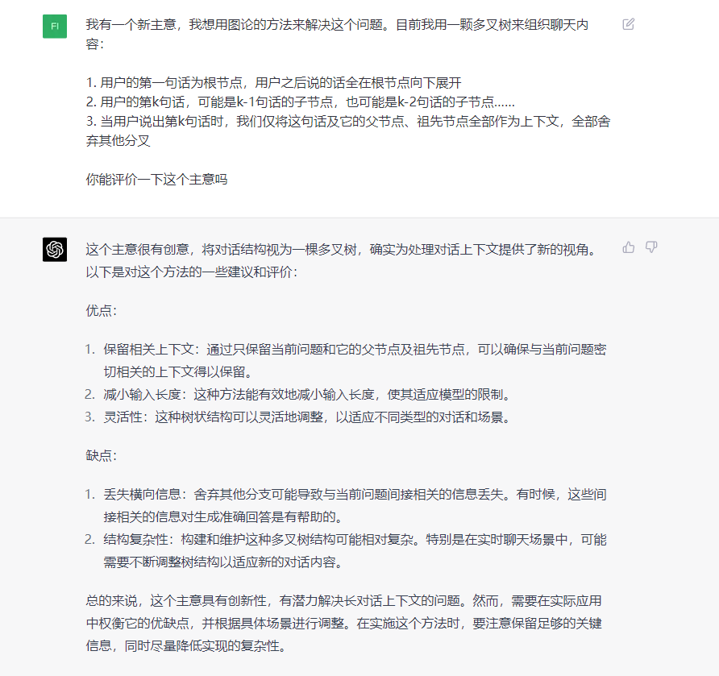

# effibot

[English](./README.md) | [中文](./README_CN.md)

ChatGPT 服务器，基于树的数据结构存储处理数据，给用户提供思维导图般使用 ChatGPT 的问答体验。
树的结构能够极大程度优化上下文的传输量（token），在公司内部使用，可以提供更好的体验。


> 图为 Demo 客户端，UI 仅供参考。  

由于工作场景下深问同一个问题的情况较少，大部分场景下 token 能被控制在 2000 以内，
因此 GPT 3.5 的 token 上限（4096）完全够用（不考虑精确度无需 GPT4）。


> 前后两张截图时间不超过 5 分钟，由于多人使用的原因，
需要查看详细日志才能分辨上述五个问题的 token 消耗，但是可以看出整体 token 的消耗可控。

## 📢更新计划

- [ ] 用户登录
- [ ] 数据持久化存储
- [ ] 快速部署脚本
- [ ] 加入写长篇小说的场景

**随缘更新**，用的人多就更新，用的人少就看心情更新。

欢迎基于这个项目开发 Web UI ！ Demo 里的 UI 是我自己写的，纯新手 UI。欢迎 PR ！

## 思路

[试用图论解决 GPT 保持会话信息问题](https://articles.zsxq.com/id_1u9cc8gccg78.html)  

将用户输入组织为一棵多叉树，只将当前分支的内容作为上下文信息传递给 GPT。
我们每次传输的内容数量，等于当前节点的深度。通过多叉树，来优化上下文的选择及传递。

一颗具有n个节点的正二叉树，其深度为 logn。这里的深度，就是我们要传递给 GPT API 的上下文信息。
如果我们不处理上下文，那可以看成一颗一维的树，即退变为一个线段，自然是最复杂的情况。
而如果我们将会话组织为树结构，即可得到一个思维导图。



## 部署使用

### 环境须知
建议服务器地址选择 OpenAI 支持的国家或地区。机房和云主机均可，下述云经过测试：
1. Azure
2. AWS

如果非要在不支持的国家或地区测试，本项目完全支持代理，但是代理本身可能会**影响体验和存在风险**。
配置方式详见配置文件 Spec.GPT.TransportUrl。  

不推荐使用代理的方式。风险自负。

### 服务器部署

确保 golang 1.18+ 已安装。

```bash
cd http
go run http.go # go build http.go && ./http
```

默认配置为 Mock 模式，即不会真正调用 GPT API，而是返回用户的输入作为回复。
默认 REST API 端口为 `4001`，配置均可在 `http/etc/http-api.yaml` 中修改。

```yaml
Name: http-api
Host: 0.0.0.0
Port: 4001 # Port of http server, default 4001
Timeout: 30000 # Timeout of http request, default 30000(ms)
Log:
  Level: debug
  Mode: file # Log mode, default console 日志模式，可选 console（命令行输出） 或 file
  Path: ../logs # Log file path, default ../logs
Spec:
  GPT:
#    Token: "sk-" # Token of OpenAI, will start mock mode if not set. OpenAI 密钥，如果不设置则启用 mock 模式
#    TransportUrl: "http://localhost:4002" # Transport url of OpenAI, default "http://localhost:4002 代理地址，如果不设置则不启用代理
    Timeout: 20s # Timeout of OpenAI request, default 20s
    MaxToken: 1000 # Max token of OpenAI response, default 1000
```

### 容器打包

```bash
docker build -t effibot:latest -f http/Dockerfile .
```

### 容器网络桥接（为了和 Demo 客户端连接）

```bash
docker network create effibot
```

### 容器部署

```bash
mkdir -p /effibot_config
cp http/etc/http-api.yaml /effibot_config
# Modify the configuration file as needed, such as adding the OpenAI token and change the log mode to console
docker run -p 4001:4001 -v /effibot_config:/app/etc --network effibot --name effibot -d effibot:latest
```

### Demo 客户端容器打包

```bash
docker build -t effibot-demo:latest -f demo/Dockerfile .
```

### Demo 客户端容器部署

```bash
docker run -p 4000:4000 --network effibot --name effibot-demo -d effibot-demo:latest
```

### Demo 客户端开发

The Demo client will automatically open at [http://localhost:5173](http://localhost:5173).

```bash
cd demo
yarn && yarn dev
```